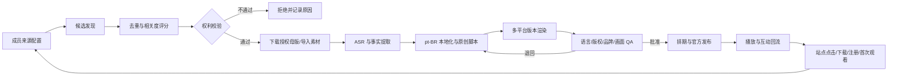

# JaguarTV 内容矩阵任务审核与团队实施方案

**审核对象：** WorkBuddy V4 Ultimate Dispatch（Machine-Optimized）  
**业务依据：** JaguarTV 双站全渠道营销方案 2026  
**审核日期：** 2026-07-20  
**结论类型：** 任务定义审核，不是已运行系统验收

## 1. 执行结论

当前 WorkBuddy 任务 **不达标，不能直接交给团队或用于批量生产发布**。

- **设计完整度：28/100。** 已描述单条足球视频的下载、音轨处理、葡语 TTS、字幕处理和归档，但没有形成完整内容运营闭环。
- **运行就绪度：无法验收。** 当前项目目录没有实现代码、依赖清单、测试、账号配置或运行记录，不能证明文中工具和接口真实可用。
- **最大阻断项：版权与平台风险。** “抓取高播放视频、保留原 BGM、去字幕/去水印、加品牌后重发”不能作为默认生产路径。翻译、配音、加 Logo 或免责声明并不会自动取得商业使用权。
- **与业务方案冲突。** 营销方案要求五类长期内容支柱、多平台改编、人工审批、授权清单、UTM 与转化回传；现任务被硬编码为足球、单文件加工和微云归档。

正确目标不是“批量搬运器”，而是一个 **有来源、有授权、有原创增量、有审核、有归因的 pt-BR 内容供应链**。

## 2. 需求理解

目标系统应服务 JaguarTV Hoje 的消费者内容矩阵，持续完成：

1. 从 Bilibili、抖音、Facebook、YouTube、TikTok、Kwai 等来源发现非葡语优质候选内容。
2. 只处理已授权、开放许可、自有或经逐条审核可用的素材。
3. 将候选内容改造成适合巴西用户的 pt-BR 内容，而不只是逐句翻译。
4. 按 Facebook、YouTube、TikTok、Kwai 的消费习惯分别生成版本。
5. 植入经审核的 JaguarTV 品牌、CTA、落地页和追踪参数。
6. 让团队成员拥有独立来源池、栏目、每日配额和负责账号。
7. 由统一审核标准控制版权、事实、语言、品牌和发布质量。
8. 将播放、互动、站点点击、下载、注册和首次观看回流到选题系统。

Instagram 可继续由 JaguarTV 营销总方案管理；本期系统先覆盖用户明确提出的 Facebook、YouTube、TikTok、Kwai，但数据模型应允许后续增加平台。

## 3. 当前任务评分

| 维度 | 权重 | 得分 | 审核判断 |
|---|---:|---:|---|
| 业务范围匹配 | 15 | 6 | 只支持足球，未覆盖娱乐、家庭、地区文化、使用与信任 |
| 来源发现 | 10 | 6 | 有关键词和热度门槛，但来源覆盖不完整，且未做重复、时效和账号体量归一化 |
| 权利与平台合规 | 15 | 0 | 没有授权台账；默认去水印和保留原 BGM 是阻断风险 |
| pt-BR 本地化 | 10 | 6 | 有术语表和 TTS 参数，但缺 ASR、语义校对、巴西事实核验和母语审校 |
| 编辑与品牌植入 | 10 | 5 | 有字幕和角标，但没有栏目模板、CTA 规则、落地页与品牌文案审核 |
| 多平台分发 | 15 | 0 | 只上传微云，没有发布、排期、平台适配或发布结果回写 |
| 团队协作 | 10 | 1 | 没有成员、来源归属、角色权限、任务领取、冲突和交接模型 |
| 数据与归因 | 10 | 2 | manifest 只记录加工过程，没有 UTM、内容效果或业务转化 |
| 可靠性与安全 | 5 | 2 | 有部分 fallback，但工具未验证，且无密钥管理、幂等、队列与审计日志 |
| **合计** | **100** | **28** | **不满足生产要求** |

> 该分数只评价任务定义覆盖度。无实际代码、依赖和运行记录，因此不能给出系统运行分。

## 4. 关键问题

### 4.1 P0 阻断项

1. **没有 Rights Gate。** 每条候选必须先有权利依据：自有、书面授权、明确允许商业改编的许可证、平台内置 Remix 权限，或经法律/合规审核的例外情形。
2. **去水印不应是标准能力。** 水印、署名和来源标识不能为掩盖来源而移除。只有自有素材、授权方交付的无水印母版，或书面授权明确允许时才可处理。
3. **原 BGM 不能默认保留。** 画面授权与音乐授权必须分别记录；无法确认商业跨平台使用权时替换为 JaguarTV 自有或已许可音乐。
4. **零人工干预不成立。** 赛事事实、版权、人物肖像、商业主张和葡语表达必须在发布前有人负责签字。
5. **没有发布闭环。** 微云是归档目标，不是 Facebook、YouTube、TikTok、Kwai 的分发系统。
6. **没有可验证实现。** 文本引用的下载器、翻译、TTS、去水印和微云接口均需先做能力探测，未注册能力不能写成必然可调用。

### 4.2 P1 业务缺口

- `topic == FOOTBALL` 与营销方案五个内容支柱不匹配。建议足球只占首期 50%–60%，其余逐步覆盖娱乐家庭、地区文化和安装教程。
- `100k views / 10k likes` 的固定门槛会偏向大账号和旧内容。应增加发布时长、账号粉丝量、观看增速、评论质量和巴西相关度。
- “非葡语”只是来源条件，不代表适合巴西。选题必须回答：巴西用户为什么现在关心，它与 JaguarTV 能提供的内容或使用场景有什么关系。
- 缺少相同赛事、相同片段、跨平台转载和团队成员之间的重复检测。
- 缺少内容事实核验、敏感内容、未成年人、博彩、事故伤病和误导标题规则。
- 没有 JaguarTV 推广位置、CTA 强度、落地页选择和 UTM 规范。

### 4.3 P1 工程缺口

- 从音轨直接 `translate` 跳过了 ASR、说话人切分、时间轴对齐和置信度门槛。
- 固定激情男声不适用于全部人物、故事和平台；应按栏目选择声音，且避免让合成声音冒充原人物。
- `var_diff < 0.15` 不能证明字幕清除质量，需要 OCR 残留、遮挡、闪烁和抽帧人工检查。
- 没有任务队列、幂等键、重试次数、死信队列、取消、超时和成本上限。
- 没有凭据隔离、最小权限、发布者二次确认、账号限流和操作审计。
- 浏览器自动解决验证码不应进入无人值守生产流程；出现验证应暂停并转人工或改用获批接口。

## 5. 建议目标架构



建议拆成八个服务边界：

| 模块 | 职责 | 不应承担 |
|---|---|---|
| Source Registry | 成员来源、关键词、白名单、抓取频率 | 下载和发布 |
| Discovery | 通过获批 API、RSS、人工链接或浏览器辅助收集元数据 | 绕过登录、验证码或访问限制 |
| Rights Ledger | 保存授权方、许可证、地区、平台、期限、音乐与肖像范围 | 根据播放量推断授权 |
| Editorial Queue | 去重、评分、领取、退回、优先级和 SLA | 自动批准高风险内容 |
| Localization | ASR、翻译、改写、术语、TTS/真人口播 | 假装原人物说了葡语内容 |
| Renderer | 画幅、字幕、片头、角标、结尾卡、音频响度 | 擅自清除来源标识 |
| Publisher | 账号排期、官方接口/获批工具发布、结果回写 | 保存所有账号的共享明文密码 |
| Analytics | 内容指标、UTM、下载、注册、首次观看和复盘 | 只用播放量判断成功 |

## 6. 团队可调用模型

### 6.1 角色

| 角色 | 权限 | 核心责任 |
|---|---|---|
| Admin | 管理品牌规则、账号绑定、成员和密钥引用 | 系统治理 |
| Scout | 管理自己的来源、提交候选 | 来源质量与初步说明 |
| Editor | 领取已过权利门的任务、制作脚本和成片 | 原创增量与交付 |
| pt-BR Reviewer | 批准语言、事实、字幕和本地语气 | 巴西母语质量 |
| Compliance Reviewer | 批准授权、音乐、肖像和商业主张 | 风险签字 |
| Publisher | 排期、发布、处理平台告警 | 账号安全与发布结果 |
| Analyst | 读取效果与转化，调整选题权重 | 周复盘 |

小团队可一人兼任多个角色，但同一高风险内容的 `Editor` 与最终 `Compliance Reviewer` 不应是同一人。

### 6.2 成员来源配置

```yaml
owner_id: user_ana
source_profile_id: ana_football_cn_v1
enabled: true
platforms:
  - bilibili
  - douyin
topics:
  - football
languages:
  include: [zh-CN, en, es]
  exclude: [pt, pt-BR]
search_terms: [巴西足球, 内马尔, 巴甲, 世界杯]
creator_allowlist: []
rights_policy: authorized_only
daily_candidate_limit: 30
daily_approved_limit: 4
target_accounts: [tiktok_hoje_br, kwai_hoje_br]
```

每名成员只能修改自己的 `source_profile`；共享的品牌、授权和账号规则由 Admin 管理。系统应记录每次配置修改者、时间和差异。

### 6.3 账号运营配置

```yaml
account_profile_id: youtube_hoje_br
platform: youtube
brand: JaguarTV Hoje
audience: brazil_consumer
content_pillars:
  hoje: 30
  sports: 25
  entertainment_family: 20
  regions_culture: 15
  product_trust: 10
recommended_duration_sec: [20, 45]
daily_publish_limit: 2
cta:
  type: watch_or_install
  landing_page: https://copa.jarg.top/
required_checks: [rights, ptbr, facts, brand, music, disclosure]
publisher_role: publisher_br
```

这里的时长和频率是 JaguarTV 内部运营建议，不应硬编码成平台永久规则；由运营负责人按实际数据版本化调整。

## 7. 内容任务与状态机

### 7.1 状态

```text
DISCOVERED
  -> DUPLICATE_REJECTED | RIGHTS_PENDING
RIGHTS_PENDING
  -> RIGHTS_REJECTED | BRIEF_READY
BRIEF_READY
  -> IN_PRODUCTION
IN_PRODUCTION
  -> QA_PENDING | PRODUCTION_FAILED
QA_PENDING
  -> REVISION_REQUIRED | APPROVED
APPROVED
  -> SCHEDULED | ARCHIVED
SCHEDULED
  -> PUBLISHED | PUBLISH_FAILED
PUBLISHED
  -> MEASURED | TAKEDOWN_REQUIRED
```

任何状态变化必须包含 `actor_id`、时间、原因和输入/输出版本。`RIGHTS_REJECTED`、`PUBLISHED` 和 `TAKEDOWN_REQUIRED` 不允许静默覆盖。

### 7.2 最小任务数据

```json
{
  "job_id": "uuid",
  "owner_id": "user_ana",
  "source": {"platform": "bilibili", "url": "...", "creator": "...", "published_at": "..."},
  "rights": {"status": "approved", "basis": "written_license", "evidence_url": "...", "expires_at": null, "music_cleared": true},
  "editorial": {"pillar": "sports", "score": 84, "brazil_angle": "...", "fact_sources": []},
  "localization": {"source_lang": "zh-CN", "target_lang": "pt-BR", "reviewer_id": "user_br_01"},
  "brand": {"cta_id": "install_tv_v2", "landing_page": "...", "utm_campaign": "hoje_sports"},
  "outputs": [{"platform": "youtube", "asset_id": "...", "status": "approved"}],
  "publish": {"account_profile_id": "youtube_hoje_br", "scheduled_at": "...", "remote_post_id": null},
  "audit": {"created_at": "...", "updated_at": "..."}
}
```

## 8. 候选评分与放行规则

先执行硬门槛，再评分。

### 8.1 硬门槛

- 权利依据可验证，且覆盖目标地区、商业用途、改编和目标平台。
- 音乐、人物肖像、赛事转播画面等权利分别确认。
- 与 JaguarTV 内容支柱或产品使用场景存在清晰连接。
- 没有明显重复、过期事实、危险行为、博彩诱导或不可核验陈述。
- 能提供实质原创增量：评论、解释、比较、教学、故事重构或本地背景。

### 8.2 100 分评分

| 指标 | 分值 |
|---|---:|
| 巴西受众相关度 | 25 |
| JaguarTV 内容/产品连接 | 25 |
| 近期传播速度（按发布时间和账号体量归一） | 15 |
| 新颖性与团队去重 | 15 |
| 可产生原创增量 | 10 |
| 制作成本与时效 | 10 |

- `80–100`：进入优先制作队列，仍需人工批准。
- `65–79`：人工候选池。
- `<65`：归档，不制作。

“美女”等宽泛、物化或与内容价值无关的关键词不应作为默认流量词。关键词库需要按栏目、人物、赛事、地区和风险标签结构化，而不是维护一个不断膨胀的平面数组。

## 9. pt-BR 二创标准

合格的二创必须同时改变 **信息价值、叙事和平台表达**：

1. 先做准确 ASR，低置信度片段标记人工听写。
2. 提取事实与观点，事实必须由可靠来源复核，尤其是比分、转会、伤病、赛程和价格。
3. 为巴西观众重写开头、背景、解释和结论，不逐句机器直译。
4. 明确标注 AI 配音或改编叙事，不让观众误以为原人物说葡语。
5. 字幕按实际语速和移动端可读性断句；母语审校后才能发布。
6. 原音乐无授权时替换；保留环境音或赛事声也需确认范围。
7. 同一母内容按平台重做前 2 秒、字幕密度、封面、标题、描述和 CTA，而不是仅改尺寸。

内容原创性建议采用内部证据检查：新旁白是否提出明确观点、引用素材是否仅为论证所需、是否加入巴西背景、是否能脱离原片独立理解。不要把“裁切、变速、镜像、去水印、加 Logo”计为原创增量。

## 10. JaguarTV 品牌与链接标准

### 10.1 内容中的品牌强度

| 场景 | 推荐做法 |
|---|---|
| 纯内容发现 | 轻角标 + 结尾 2–3 秒 CTA，不打断主体 |
| 今日赛事/节目 | 引导到 JaguarTV Hoje 对应内容页 |
| 安装教程 | 展示 Android/Android TV/TV Box 路径和 Downloader `2252960` |
| 权益说明 | 只使用运营已审核的 7 天试用等真实规则 |
| 伙伴内容 | 引导到 parceiros 角色页，不与消费者 CTA 混用 |

### 10.2 链接归因

每条发布内容必须生成唯一 `content_id`，并至少记录：

```text
utm_source=facebook|youtube|tiktok|kwai
utm_medium=organic_social|paid_social
utm_campaign=hoje_sports|hoje_entertainment|install_help
utm_content=<content_id>_<hook_version>
owner_id=<internal_member_id>
```

`owner_id` 应使用不含姓名、电话或其他个人信息的内部 ID。平台简介、置顶评论或可点击区域使用完整追踪链接；画面内使用简短、稳定的官方域名或 QR，不显示长 UTM。

## 11. 平台运营标准

| 平台 | 内容任务 | 内部建议 | 重点审核 |
|---|---|---|---|
| YouTube Shorts | 搜索可发现、解释和长期资产 | 20–45 秒；标题回答明确问题；可延伸长视频 | 重复/批量低原创、音乐和画面权利、标题事实 |
| TikTok | 快速发现、真人感和强开头 | 12–35 秒；一个视频只讲一个点 | 误导钩子、搬运感、商业披露和安全内容 |
| Kwai | 本地生活、社区和下沉城市表达 | 20–45 秒；语气自然、场景具体 | 低质重复、过度促销、人物与音乐授权 |
| Facebook | 30+ 用户、群组、本地商业和转化 | 20–60 秒；正文补充上下文；CTA 清晰 | 诱导互动、群组规则、链接承接和评论客服 |

所有账号统一：头像、品牌名、产品事实、官方域名、客服入口和危机升级方式。各平台允许有不同栏目和语气，但不允许价格、试用、设备支持和联系方式互相矛盾。

## 12. 发布前检查单

每项必须有 `pass/fail/not_applicable` 和审核人：

- 来源 URL、作者和原始发布时间已保存。
- 权利证据覆盖画面、音乐、肖像、商业改编、地区和目标平台。
- 没有通过去水印隐藏来源。
- 葡语经 pt-BR 母语审核，专名、比分、日期和时区准确。
- AI 配音/合成内容按需要披露，未伪装成原人物发言。
- 内容有实质原创增量，并符合对应栏目。
- JaguarTV Logo、安全区、字幕、音量、封面和结尾卡正确。
- CTA、落地页、产品事实、优惠和 WhatsApp 信息是当前版本。
- UTM、`content_id`、成员归因和账号归属正确。
- 已通过敏感内容、未成年人、博彩、伤病、隐私和误导性检查。
- 发布者确认排期、频率和同账号去重。
- 原始素材、工程文件、授权证据、成片和 manifest 已归档。

## 13. KPI

系统不能以下载成功或播放量作为最终成功。

| 层级 | 指标 |
|---|---|
| 来源 | 候选通过率、重复率、授权通过率、每个来源的有效候选成本 |
| 生产 | 平均交付时间、返工率、pt-BR 错误率、渲染失败率、单条成本 |
| 发布 | 发布成功率、准时率、账号告警、删除/申诉/版权声明数 |
| 内容 | 3 秒留存、完播、分享、收藏、有效评论、负反馈 |
| 站点 | 内容页点击、参与、Watch Banner 点击、下载和注册点击 |
| 业务 | 注册完成、首次观看、试用转付费、续费、按内容计算 CAC |
| 团队 | 每人成熟来源数、获批内容数、下游转化贡献、违规率 |

团队激励不要只按发布条数或播放量计算，否则会推动重复、夸张和高风险素材。建议按“合规通过 × 有效互动 × 下游转化”综合评价。

## 14. MVP 范围与验收

第一期不要同时自动化全部平台和全部来源。建议 4 周 MVP：

- 来源：Bilibili + YouTube 的获批来源/人工提交链接。
- 主题：足球 + 安装/使用教程。
- 输出：TikTok、Kwai、YouTube Shorts 三种模板；Facebook 先人工发布。
- 团队：2 名 Scout、1 名 Editor、1 名 pt-BR/合规 Reviewer、1 名 Publisher，可兼岗。
- 发布：先保留人工最终确认；接入官方允许的发布方式后再逐账号开放自动排期。

### MVP 必须通过的验收项

1. 3 名成员能各自维护来源配置，互不覆盖。
2. 100 个候选可完成去重、评分、领取和审计追踪。
3. 未提供权利证据的任务 100% 无法进入制作和发布。
4. 20 条获批素材能生成 3 个平台版本，所有版本可追溯到同一母任务。
5. 20 条内容全部有 pt-BR 和合规审核记录。
6. 发布失败可重试但不会重复发帖；远端 post ID 能回写。
7. 每条内容都有唯一 UTM，能看到至少“平台内容 -> 站点点击”的回流。
8. 能一键暂停某个来源、成员或账号，且不会影响其他队列。
9. 能按授权到期日搜索并下架受影响内容。
10. 无明文账号密码进入日志、manifest 或共享配置。

只有 MVP 连续两周稳定、无重大版权/账号事件，并能证明内容带来有效站点访问后，才扩展抖音、Facebook 原生来源和更高自动化程度。

## 15. 30/60/90 天路线

### 0–30 天：治理与最小闭环

- 建立来源白名单、Rights Ledger、成员角色和账号清单。
- 确认 JaguarTV Logo、角标、结尾卡、CTA 和 pt-BR 术语母版。
- 完成候选队列、去重、审核、三平台渲染和微云归档。
- 人工发布 20–40 条内容，建立留存、点击和违规基线。

### 31–60 天：分发与数据回流

- 接入目标账号获批发布方式，支持排期、幂等和远端 ID 回写。
- 接入站点 UTM、下载、注册和首次观看事件。
- 按来源、栏目、成员和账号建立周看板。
- 淘汰只有播放、没有有效互动或站点贡献的来源。

### 61–90 天：扩来源与优化

- 在权利和接口路径确认后增加抖音、Facebook、TikTok、Kwai 候选源。
- 按表现扩展娱乐家庭、地区文化和使用信任内容。
- 为低风险白名单开放“自动生成草稿”，仍保留发布审批。
- 用业务转化而非播放量决定产能、账号和预算扩张。

## 16. 对原 WorkBuddy 文本的处理建议

可保留并重写：

- manifest 思路，但扩展为权利、审核、平台版本、发布和归因记录。
- 音画分离、ASR/TTS、字幕、渲染和失败回退。
- 抽帧画面检查，但用途改为字幕安全区、Logo 遮挡和画质 QA。
- 微云按日期归档，但增加任务 ID、版本、权限证据和保留策略。

应删除或禁止作为默认路径：

- `HEADLESS_AUTONOMOUS / Zero human intervention`。
- 自动解验证码或绕过平台访问限制。
- 默认去水印、模糊来源标识或保留未授权 BGM。
- 仅凭固定播放/点赞阈值自动选择并加工。
- 未验证就调用命名工具或假定存在 API。
- 把“上传微云成功”定义为内容任务成功。

最终生产成功状态应定义为：

```text
PUBLISHED_AND_TRACKED =
  rights_approved
  AND ptbr_approved
  AND compliance_approved
  AND platform_publish_succeeded
  AND remote_post_id_recorded
  AND tracking_link_verified
```

业务成功则需要继续观察 `first_watch`、付费和续费，不能在发布完成时宣告。

## 17. 下一步决策

在进入开发前，管理层需确认：

1. 哪些来源已有书面商业改编与跨平台发布授权。
2. 每个平台首期使用哪些 JaguarTV 账号，谁是账号责任人。
3. 哪个官方落地页对应消费者观看、安装和伙伴招募。
4. 谁担任 pt-BR 最终审校和版权/合规最终审核。
5. 第一阶段每日可承受多少条候选、制作和发布量。
6. 微云是否只做归档，账号凭据和授权证据存放在哪里。
7. 是否已有可用的官方平台 API/排期工具；没有时按人工发布设计。

这些信息确认后，才适合把本文拆成产品需求、数据模型、接口合同和实现任务。

## 18. 审核依据

以下平台官方说明支持本文将“权利、原创性、商业音乐和 AI 披露”拆成独立门槛：

- [YouTube Copyright](https://support.google.com/youtube/answer/2797466?hl=en)：视频通常在创作时即受版权保护；安全使用路径包括取得许可、适用的版权例外、公共领域或符合许可条款。
- [YouTube Channel Monetisation Policies](https://support.google.com/youtube/answer/1311392?hl=en-GB&p=reused_content)：频道还会单独审核 reused/inauthentic content；版权无索赔不等于内容满足原创与变现要求。
- [TikTok Copyright](https://support.tiktok.com/en/safety-hc/account-and-user-safety/copyright)：发布他人受版权保护内容通常需要适当授权或其他合法依据，重复侵权会影响账号。
- [TikTok Commercial Use of Music](https://support.tiktok.com/en/business-and-creator/creator-and-business-accounts/commercial-use-of-music-on-tiktok?lang=en)：推广品牌、产品或服务时，平台建议使用 Commercial Music Library；使用外部音乐需要确认拥有必要许可。
- [TikTok AI-generated Content](https://support.tiktok.com/en/using-tiktok/creating-videos/ai-generated-content)：真实人物被 AI 改为说出其未说过的话等情形属于显著 AI 编辑，需按平台规则进行标签或披露。

平台规则与法律要求会更新。上线前应由账号负责人复核各平台当期规则，并由熟悉巴西及素材来源地的专业人员审核具体授权范围；本文不是法律意见。
