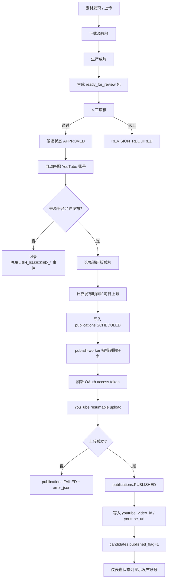
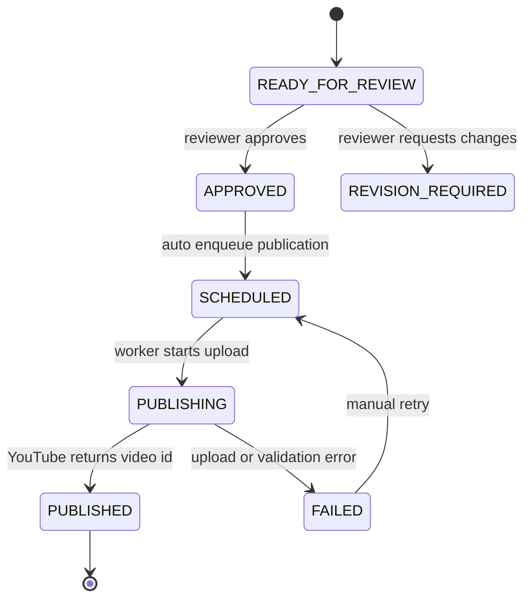

# YouTube 自动发布流程图

```mermaid
flowchart TD
  A["素材发现 / 上传"] --> B["下载源视频"]
  B --> C["生产成片"]
  C --> D["生成 ready_for_review 包"]
  D --> E["人工审核"]
  E -->|通过| F["候选状态 APPROVED"]
  E -->|返工| G["REVISION_REQUIRED"]
  F --> H["自动匹配 YouTube 账号"]
  H --> I{"来源平台允许发布?"}
  I -->|否| J["记录 PUBLISH_BLOCKED_* 事件"]
  I -->|是| K["选择通用版成片"]
  K --> L["计算发布时间和每日上限"]
  L --> M["写入 publications:SCHEDULED"]
  M --> N["publish-worker 扫描到期任务"]
  N --> O["刷新 OAuth access token"]
  O --> P["YouTube resumable upload"]
  P --> Q{"上传成功?"}
  Q -->|否| R["publications:FAILED + error_json"]
  Q -->|是| S["publications:PUBLISHED"]
  S --> T["写入 youtube_video_id / youtube_url"]
  T --> U["candidates.published_flag=1"]
  U --> V["仪表盘状态列显示发布账号"]
```

## 状态机

```mermaid
stateDiagram-v2
  [*] --> READY_FOR_REVIEW
  READY_FOR_REVIEW --> APPROVED: reviewer approves
  READY_FOR_REVIEW --> REVISION_REQUIRED: reviewer requests changes
  APPROVED --> SCHEDULED: auto enqueue publication
  SCHEDULED --> PUBLISHING: worker starts upload
  PUBLISHING --> PUBLISHED: YouTube returns video id
  PUBLISHING --> FAILED: upload or validation error
  FAILED --> SCHEDULED: manual retry
  PUBLISHED --> [*]
```
