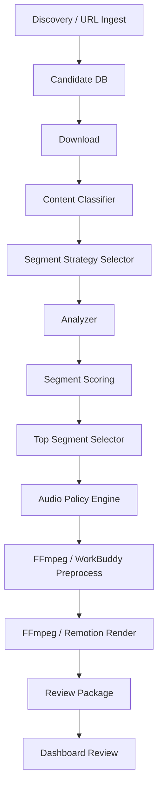

# JaguarTV Phase 1.1 智能内容工厂产品需求文档

版本：v0.1
日期：2026-07-27
关联代码库：`0925lyz/jaguartv-content-factory-vnext-l4`
本地分析目录：

- `/Users/yoyo/Documents/Codex/2026-07-24/ni/jaguartv-content-factory`
- `/Users/yoyo/Documents/jaguar_factory/workbuddy/刘一朝`

服务器部署信息：

- GitHub 代码部署目标服务器：`ubuntu@43.134.128.197`
- SSH 登录方式：`ssh -i ~/.ssh/jarg_tencent.pem ubuntu@43.134.128.197`

> 本文档基于本地两个项目现状与《智能切片与内容类型策略架构需求说明.md》的目标方向整理，并作为 vNEXT 融合实现的需求基线。仓库已实现 Phase 1.1 的核心闭环，生产服务器切换仍需独立发布确认。

---

## 1. 项目背景

JaguarTV 内容工厂的目标是批量生产适合巴西用户观看的短视频素材，用于 YouTube Shorts、TikTok、Kwai、Facebook Reels 等平台矩阵账号，为 JaguarTV 带来 App 下载、注册和首次观看转化。

当前已经存在两个相关项目：

1. `jaguartv-content-factory`：偏产品化内容工厂，具备候选发现、下载、库存管理、本地 UI、FFmpeg / Remotion 渲染、JaguarTV 品牌包装、审核包和增长数据面板。
2. `workbuddy / wb-brazil-vnext`：偏自动化二创流水线，具备 MediaCrawler 爬取、中文音频识别、OCR 中文文本区域模糊、葡语翻译、edge-tts 配音、demucs 伴奏分离、尾卡和飞书归档。

两个项目能力互补，但都还没有完整达到 Phase 1.1 的理想目标：系统不仅要“能剪”，还要“会判断内容类型、会选择片段、会选择音频策略、能解释为什么选这个片段”。

---

## 2. 当前项目能力盘点

### 2.1 `jaguartv-content-factory` 已有能力

代码位置：`/Users/yoyo/Documents/Codex/2026-07-24/ni/jaguartv-content-factory`

核心能力：

- 候选发现：支持 YouTube、Bilibili、Douyin，Xiaohongshu 通过 URL 导入。
- 候选入库：使用 SQLite `workspace/factory.db` 管理候选、事件、发布队列、表现数据。
- 候选评分：按热度、互动、相关度、可剪辑性、巴西适配、新鲜度评分。
- 下载能力：通过 `yt-dlp` 或自建 API 服务下载素材。
- 生产能力：支持单条或批量制作。
- 切片能力：可按固定时间窗口生成 Shorts。
- 渲染能力：支持 FFmpeg 快速渲染与 Remotion 品牌化渲染。
- 品牌包装：Logo、角标、封面、尾图、CTA、`Jarg.top` 追踪链接。
- 本地 UI：库存、任务、发布队列、增长分析、运行节点、系统管理、登录态管理。
- 审核交付：输出到 `workspace/ready_for_review/<id>/`，包含 `video.mp4`、`cover.jpg`、`metadata.json`、`review.json`。
- 增长闭环：支持平台表现快照、转化事件、关键词反馈建议。
- 服务器部署文档：已有腾讯云轻量服务器部署、GitHub 更新和 systemd 运维文档。

主要不足：

- 没有内容类型识别模块。
- 长视频切片仍是按时间均匀切片，不识别精彩片段。
- 没有足球进球、欢呼、冲刺、庆祝、回放等事件检测。
- 音频策略主要按字幕/ASR 是否存在判断，不按内容类型判断。
- 没有独立的 `source_plus_funk`、`funk_only`、`preserve_ptbr_voice_light_bgm` 等策略层。
- UI 没有制作前的内容类型、切片策略、音频策略人工覆盖入口。
- 审核页没有展示 `highlight_score`、`highlight_reasons`、`content_type`、`segment_strategy`。
- CLI 的 `produce` 命令没有 Phase 1.1 参数。

### 2.2 `workbuddy / wb-brazil-vnext` 已有能力

代码位置：`/Users/yoyo/Documents/jaguar_factory/workbuddy/刘一朝`

核心能力：

- 爬取入口：通过 MediaCrawler 对抖音、B站、小红书按关键词爬取。
- 候选筛选：按点赞、播放量、时长过滤，默认偏足球关键词。
- 下载策略：按平台 JSONL 提供的视频直链下载，本地 raw 优先。
- 连续模式：`VNEXT_LOOP=1` 可定时扫描新素材。
- 三分类：
  - Class-1：中文音频 + 屏幕中文，执行完整葡语二创。
  - Class-2：无中文音频，保留原片 + 图1 + 尾卡。
  - Class-3：有中文音频但无屏幕中文，仅配音。
- 中文音频识别：faster-whisper ASR。
- OCR 检测：用 pytesseract 检测中文文本区域。
- 精准模糊：只模糊中文文本区域，不整屏遮挡。
- 翻译：通过 Google Translate web endpoint 做中文到葡语。
- TTS：使用 edge-tts 生成 pt-BR 配音。
- 音频处理：使用 demucs 分离 no_vocals 伴奏，混合 BGM + 葡语配音。
- 字幕：Class-1 烧录葡语字幕，Class-3 不烧字幕。
- 品牌元素：叠加图1，追加图2/图3尾卡。
- 飞书归档：上传到 `巴西二创视频/<YYYY-MM-DD>/`，并按同名前缀去重。
- 运行状态：通过 manifest、counter、blacklist、skip、run log 记录运行状态。

主要不足：

- 产品范围过窄，基本聚焦“中文足球素材二创”，不支持多内容类型策略。
- 没有统一候选库存 UI、审核 UI、人工复核工作台。
- 没有 `workspace/ready_for_review/` 风格的人审交付包。
- 默认过滤 `max_duration_sec=60`，不解决长视频智能切片。
- 没有足球精彩片段评分，只处理短素材或已筛选素材。
- 没有候选级数据库，运行状态主要依赖 JSON manifest。
- 没有 `Jarg.top` CTA、UTM、JaguarTV 多平台发布文案包。
- 没有 YouTube Shorts / TikTok / Kwai / Facebook Reels 的平台化元数据输出。
- 没有本地 Content OS UI。
- 没有内容类型规则：舞蹈、音乐、搞笑、动画少儿、肥皂剧、解说等无法区分。
- 没有内容类型驱动的音频策略，当前策略更像中文语音驱动。
- 飞书自动上传属于归档能力，但 Phase 1.1 的理想边界要求重点是“成片待审核”，自动发布和复杂权限先不做。
- CI 主要是语法编译和导入冒烟测试，没有核心处理逻辑单元测试。

---

## 3. 产品定位

### 3.1 产品名称

JaguarTV 智能内容工厂 Phase 1.1

### 3.2 产品一句话

一个面向巴西市场的短视频内容生产系统，可以从多平台发现素材，自动识别内容类型，选择合适的切片和音频策略，生成带 JaguarTV 品牌元素的待审核 Shorts 成片包。

### 3.3 阶段边界

本阶段只完成：

- 爬取 / 导入素材；
- 下载源视频；
- 候选库存管理；
- 内容类型识别；
- 智能切片；
- 音频策略选择；
- 二创剪辑；
- 品牌化包装；
- 成片待审核；
- 本地 UI 人工覆盖和审核。

本阶段不做：

- 自动发布；
- 多账号权限系统；
- 复杂分布式队列；
- 大规模 OCR 比分牌识别；
- 自动版权风险判断；
- 自动平台封号风险判断；
- 完整 AI 训练闭环。

---

## 4. 目标用户与使用场景

### 4.1 目标用户

1. 内容运营负责人
   负责设置素材方向、审核成片质量、决定是否进入发布队列。

2. 素材采集人员 / Agent
   负责从 YouTube、B站、抖音、小红书等平台发现候选素材。

3. 本地化剪辑人员 / Agent
   负责下载素材、执行二创、生成待审核包。

4. 质量审核人员
   负责检查成片内容、音频策略、字幕、品牌元素、CTA、元数据。

5. 技术运维人员
   负责 GitHub 到服务器部署、依赖安装、服务运行、日志排查。

### 4.2 核心场景

场景 A：足球长视频智能切片
系统下载一个 5-10 分钟足球集锦，自动找出 1-3 个 30 秒以内精彩片段，标明分数和原因，生成 JaguarTV 品牌成片。

场景 B：舞蹈 / 音乐素材处理
系统识别为音乐舞蹈类，不强行生成葡语配音和字幕，优先保留源音乐或加入 Funk BGM。

场景 C：动画少儿 / 肥皂剧处理
系统识别已有葡语或对白类内容，优先保留原声，只叠加轻背景音乐和品牌元素。

场景 D：解说 / 教程 / 新闻本地化
系统识别为解说知识类，移除源音，生成葡语配音、葡语字幕和 Funk BGM。

场景 E：人工覆盖
运营人员在 UI 中手动覆盖内容类型、切片策略、音频策略、最大切片数和最大时长，避免自动判断错误。

---

## 5. 产品目标

### 5.1 业务目标

- 提升成片产量：每天稳定产出可审核短视频素材。
- 提升素材命中率：从“随机切”升级为“优先切精彩片段”。
- 降低人工剪辑成本：减少手动找片段、配音、加字幕、加尾卡工作。
- 提升巴西用户适配度：不同内容类型采用不同音频和本地化策略。
- 提升审核效率：每个成片都有可解释元数据。

### 5.2 产品目标

- 系统自动识别 8 类内容类型。
- 系统自动选择 5 类切片策略。
- 系统自动选择 5 类音频策略。
- 足球素材可以自动输出 Top 1-3 个精彩片段。
- UI 支持人工覆盖关键策略。
- 审核包展示“为什么选这个片段”。

### 5.3 技术目标

- 复用 `jaguartv-content-factory` 的 UI、数据库、审核包、品牌和部署能力。
- 复用 `workbuddy` 的 ASR、OCR、TTS、demucs、精准模糊能力。
- 新增策略层，将内容类型、切片策略、音频策略解耦。
- 保持 Phase 1.1 依赖轻量，不引入重型训练模型。

---

## 6. 功能需求

### 6.1 素材发现 Discovery

优先级：P0

需求：

- 支持 YouTube、Bilibili、Douyin、Xiaohongshu。
- 支持关键词发现。
- 支持 URL 手动导入。
- 支持平台语言路由：
  - YouTube：en / es / pt 关键词；
  - Bilibili / Douyin / Xiaohongshu：zh / zh-CN 关键词。
- 支持过滤：
  - 最低播放量；
  - 最低点赞量；
  - 最大源视频时长；
  - 最低分辨率；
  - 语言排除。
- 支持候选去重。

现有基础：

- `jaguartv-content-factory` 已有通用 discovery 和候选评分。
- `workbuddy` 已有 MediaCrawler JSONL 读取和按 likes / views / duration 过滤。

待补齐：

- 统一两个项目的候选数据结构。
- 把 MediaCrawler 结果导入 `factory.db`。
- 保留原始平台字段、下载直链、页面 URL、标题、描述、标签、封面。

### 6.2 候选库存 Candidate Inventory

优先级：P0

需求：

- 每条候选记录包含：
  - candidate_id；
  - platform；
  - source_id；
  - source_url；
  - title；
  - description；
  - duration；
  - width / height；
  - detected_language；
  - content_type；
  - content_type_confidence；
  - segment_strategy；
  - audio_policy；
  - candidate_score；
  - status；
  - created_at / updated_at。
- UI 中显示内容类型、切片策略、音频策略、预计可生成片段数、最高精彩度。

现有基础：

- `jaguartv-content-factory` 已有 SQLite 候选库和 UI 库存页。

待补齐：

- 增加内容类型和策略字段。
- 支持从 `workbuddy` manifest / JSONL 导入候选。

### 6.3 内容类型识别 Content Classifier

优先级：P0

支持类型：

- `football`：足球赛事；
- `sports_highlight`：体育集锦；
- `dance_music`：舞蹈 / 音乐 / Funk；
- `comedy_life`：搞笑 / 生活 / 无对白；
- `cartoon_kids`：动画少儿；
- `soap_opera`：肥皂剧 / 短剧；
- `commentary`：解说 / 新闻 / 知识 / 教程；
- `unknown`：未知类型。

判断依据：

- 标题；
- 描述；
- 关键词；
- 标签；
- 来源频道；
- 字幕语言；
- ASR 语言；
- 屏幕 OCR 文本；
- 候选来源平台。

Phase 1.1 实现方式：

- 规则优先，不依赖重型 AI 模型。
- 每个规则输出：
  - content_type；
  - confidence；
  - matched_rules；
  - suggested_segment_strategy；
  - suggested_audio_policy。

待补齐：

- `jaguartv-content-factory` 目前没有 classifier。
- `workbuddy` 只有中文语音三分类，不等于内容类型分类。

### 6.4 切片策略 Segment Strategy

优先级：P0

支持策略：

- `uniform`：普通均匀切片；
- `sports_highlight`：足球 / 体育精彩切片；
- `rhythm_cut`：节奏切片；
- `visual_peak`：画面峰值切片；
- `story_safe`：剧情安全切片；
- `dialogue_scene`：对白场景切片；
- `summary_cut`：摘要式本地化切片。

Phase 1.1 必须完成：

- `uniform`；
- `sports_highlight`；
- `visual_peak` 的轻量版本可复用运动 / 场景变化；
- 其他策略先可降级到 `uniform`，但 metadata 需要记录 fallback。

现有基础：

- `jaguartv-content-factory` 已有均匀切片。

待补齐：

- 策略选择层；
- 策略 fallback；
- 片段评分；
- Top 片段选择。

### 6.5 足球精彩片段分析 Football Highlight Analyzer

优先级：P0

目标：

对足球赛事 / 体育集锦素材，从长视频中自动选择 1-3 个 30 秒以内精彩片段。

Phase 1.1 信号：

- 音量峰值；
- 画面运动强度；
- 镜头切换；
- 字幕 / 标题关键词；
- 回放关键词；
- OCR 关键词可作为 Phase 1.2。

评分公式：

```text
highlight_score =
  audio_peak_score   * 0.35 +
  motion_score       * 0.25 +
  scene_change_score * 0.20 +
  keyword_score      * 0.15 +
  replay_score       * 0.05
```

输出：

```json
{
  "source_start": 78.0,
  "source_end": 108.0,
  "duration": 30.0,
  "highlight_score": 86.4,
  "highlight_reasons": [
    "audio_peak",
    "motion_peak",
    "scene_change"
  ]
}
```

待补齐：

- `jaguartv-content-factory` 没有精彩度评分。
- `workbuddy` 没有长视频 Top 片段选择，且默认过滤 60 秒以上素材。

### 6.6 音频策略 Audio Policy Engine

优先级：P0

支持策略：

| 内容类型 | 默认音频策略 | 保留原声 | Funk BGM | 葡语配音 | 葡语字幕 |
|---|---|---:|---:|---:|---:|
| 足球赛事 | `source_plus_funk` | 是 | 是 | 否 | 否 |
| 体育集锦 | `source_plus_funk` | 是 | 是 | 否 | 否 |
| 舞蹈 / 音乐 / Funk | `funk_or_source_music` | 可选 | 是 | 否 | 否 |
| 搞笑 / 生活 / 无对白 | `funk_only` | 否 | 是 | 否 | 否 |
| 动画少儿 | `preserve_ptbr_voice_light_bgm` | 是 | 轻量 | 否 | 否 |
| 肥皂剧 / 短剧 | `preserve_ptbr_voice_light_bgm` | 是 | 轻量 | 否 | 否 |
| 解说 / 新闻 / 教程 | `localize_ptbr` | 否 | 是 | 是 | 是 |
| 静音素材 | `bgm_only` | 否 | 是 | 否 | 否 |

现有基础：

- `jaguartv-content-factory` 有 `localized / preserve_source / bgm_only` 三态。
- `workbuddy` 有中文音频驱动的配音 / 模糊 / 字幕 / 保留原片策略。

待补齐：

- 建立独立 `AudioPolicyEngine`。
- 将 `workbuddy` 的 ASR / TTS / demucs 能力作为 `localize_ptbr` 策略的底层实现。
- 将 `jaguartv-content-factory` 的 Remotion BGM 叠加能力作为 `source_plus_funk` 底层实现。

### 6.7 视频二创与渲染 Renderer

优先级：P0

需求：

- 支持 FFmpeg 快速渲染。
- 支持 Remotion 品牌模板渲染。
- 支持保留原始比例或强制竖屏。
- 支持 Logo、角标、CTA、尾卡。
- 支持源音 + Funk 混音。
- 支持源音移除 + 葡语配音 + 葡语字幕 + Funk BGM。
- 支持 OCR 中文文本区域模糊。
- 支持尾卡固定时长。

现有基础：

- `jaguartv-content-factory` 有 FFmpeg / Remotion / 品牌包装。
- `workbuddy` 有 OCR 精准模糊、TTS、demucs 和尾卡。

待补齐：

- 统一渲染接口。
- 将 `workbuddy` 的 OCR 模糊能力接入 `jaguartv-content-factory` 的生产流程。
- 输出统一 metadata。

### 6.7.1 Reaction 渲染

优先级：P0

输入：运营上传的真人 Reaction 视频、已授权数字人 Reaction 视频，或外部 Reaction 生成工具输出的标准媒体文件。由于未提供指定第三方工具的 API、仓库和凭据，Phase 1.1 通过稳定文件适配契约接入，不绑定某个供应商。

布局：

- `none`：不使用 Reaction；
- `picture_in_picture`：画中画，可选四角位置；
- `split_vertical`：主素材与 Reaction 上下分屏；
- `side_by_side`：主素材与 Reaction 左右分屏。

要求：

- Reaction 较短时允许循环到内容段结束；
- Reaction 只覆盖内容段，不能覆盖 JaguarTV 尾卡；
- 源音量和 Reaction 音量可单独配置；
- 输出保持原成片分辨率、帧率和可播放音轨；
- metadata 记录 Reaction 来源路径、布局、音量和位置；
- Reaction 必须提供实质评论、分析或教育表达，不得作为规避版权检测的装饰。

### 6.7.2 factory.jarg.top 服务器资产存储

优先级：P0

- 所有运行时视频保存在腾讯云服务器，不上传 Lark 或其他办公协作盘。
- 源素材和 Reaction 输入写入私有 `workspace/server_media/uploads/`，不暴露公开 URL。
- 审核包写入 `workspace/server_media/review/<package_id>/`。
- 审核视频通过 `https://factory.jarg.top/media/review/<package_id>/video.mp4` 访问。
- 上传使用 `JAGUARTV_UPLOAD_TOKEN`，服务端采用流式写入、大小校验、扩展名白名单、临时文件和原子重命名。
- Nginx 请求体上限为 2GB；应用层使用相同或更低限制。

### 6.8 审核包 Review Package

优先级：P0

输出目录：

```text
workspace/ready_for_review/<package_id>/
  video.mp4
  cover.jpg
  metadata.json
  review.json
```

metadata 必须包含：

```json
{
  "job_id": "84a09a44e065481a_part01",
  "source_job_id": "84a09a44e065481a",
  "content_type": "football",
  "content_type_confidence": 0.82,
  "segment_strategy": "sports_highlight",
  "audio_policy": "source_plus_funk",
  "operator_override": false,
  "segment": {
    "source_start": 78.0,
    "source_end": 108.0,
    "duration": 30.0,
    "highlight_score": 86.4,
    "highlight_reasons": ["audio_peak", "motion_peak", "scene_change"]
  },
  "audio": {
    "source_audio_preserved": true,
    "source_volume": 0.65,
    "bgm_enabled": true,
    "bgm_volume": 0.35,
    "tts_enabled": false,
    "subtitles_enabled": false
  },
  "brand": {
    "watermark": true,
    "cta_url": "https://copa.jarg.top/",
    "endcard": true
  }
}
```

现有基础：

- `jaguartv-content-factory` 已有审核包结构。

待补齐：

- 增加内容类型、策略、精彩度、原因。
- 审核页显示上述字段。
- `workbuddy` 旧归档链路不迁入，所有结果必须先进入服务器待审核目录。

### 6.9 本地 UI

优先级：P0

库存页新增字段：

- 内容类型；
- 切片策略；
- 音频策略；
- 预计片段数；
- 最高精彩度；
- 是否需要葡语本地化。

制作前弹窗：

- 内容类型：自动 / 足球 / 体育 / 舞蹈音乐 / 搞笑生活 / 动画少儿 / 肥皂剧 / 解说知识；
- 切片策略：自动 / 均匀 / 体育精彩 / 节奏 / 视觉峰值 / 剧情安全 / 摘要；
- 音频策略：自动 / Funk Only / 保留源音乐 / 源音 + Funk / 葡语配音字幕；
- 最大切片数：1 / 2 / 3；
- 单片最大时长：15 / 20 / 30 秒；
- 是否保留原声；
- 是否添加 Funk BGM；
- 是否生成葡语配音；
- 是否生成葡语字幕。

审核页新增展示：

- 内容类型；
- 切片策略；
- 音频策略；
- 源视频时间段；
- 精彩度分数；
- 触发原因；
- 是否保留源音；
- 是否添加 Funk；
- 是否生成葡语配音；
- 是否生成葡语字幕。

现有基础：

- `jaguartv-content-factory` 已有 UI 框架。

待补齐：

- 制作弹窗；
- 策略字段；
- 审核详情展示；
- 人工覆盖保存和传入生产流程。

### 6.10 CLI

优先级：P1

保留：

```bash
workbuddy produce --candidate <id>
```

新增：

```bash
workbuddy produce \
  --candidate <id> \
  --content-type football \
  --segment-strategy sports_highlight \
  --audio-policy source_plus_funk \
  --max-segments 3 \
  --max-duration 30
```

新增批量制作：

```bash
workbuddy produce-batch \
  --status DOWNLOADED \
  --limit 10 \
  --strategy auto
```

新增分析命令：

```bash
workbuddy analyze --candidate <id>
```

输出内容：

- content_type；
- segment_strategy；
- audio_policy；
- candidate_segments；
- highlight_score；
- reasons。

---

## 7. 数据结构需求

### 7.1 Candidate 级别

```json
{
  "candidate_id": "84a09a44e065481a",
  "platform": "youtube",
  "source_id": "abc123",
  "source_url": "https://example.com/video",
  "title": "Amazing football goal",
  "description": "",
  "duration": 420.5,
  "width": 1920,
  "height": 1080,
  "detected_language": "en",
  "content_type": "football",
  "content_type_confidence": 0.82,
  "segment_strategy": "sports_highlight",
  "audio_policy": "source_plus_funk",
  "operator_override": false,
  "status": "DOWNLOADED"
}
```

### 7.2 Segment 级别

```json
{
  "package_id": "84a09a44e065481a_part01",
  "source_start": 78.0,
  "source_end": 108.0,
  "duration": 30.0,
  "highlight_score": 86.4,
  "highlight_reasons": ["audio_peak", "motion_peak", "scene_change"],
  "strategy": "sports_highlight",
  "fallback": false
}
```

### 7.3 Audio 级别

```json
{
  "audio_policy": "source_plus_funk",
  "source_audio_preserved": true,
  "source_volume": 0.65,
  "bgm_enabled": true,
  "bgm_volume": 0.35,
  "tts_enabled": false,
  "subtitles_enabled": false,
  "reason": "football_default_policy"
}
```

### 7.4 Operator Override

```json
{
  "operator_override": true,
  "overrides": {
    "content_type": "football",
    "segment_strategy": "sports_highlight",
    "audio_policy": "source_plus_funk",
    "max_segments": 3,
    "max_duration": 30
  },
  "operator": "dashboard",
  "updated_at": "2026-07-27T00:00:00Z"
}
```

---

## 8. 系统架构

目标架构：



建议融合方式：

- 以 `jaguartv-content-factory` 作为主产品壳：
  - CLI；
  - SQLite；
  - UI；
  - 审核包；
  - 品牌包装；
  - 服务器部署。
- 将 `workbuddy` 作为能力模块迁入或适配：
  - ASR 分类；
  - OCR 中文文本区域检测；
  - OCR 模糊；
  - edge-tts；
  - demucs；
  - MediaCrawler JSONL ingest；
  - 旧归档步骤不迁入；成片统一进入 `factory.jarg.top` 服务器资产区。

---

## 9. 非功能需求

### 9.1 性能

- 单条 30 秒以内素材生产应在本地 3-8 分钟内完成。
- 长视频分析阶段应支持采样，不做全量逐帧 OCR。
- Phase 1.1 OCR 默认只用于中文文本模糊，不用于比分牌大规模识别。

### 9.2 稳定性

- 单条候选失败不影响批量任务继续。
- 下载失败、生产失败、上传失败必须记录事件。
- 同一候选不得并发生产。
- 中断后可从状态继续。

### 9.3 可解释性

- 自动分类必须记录匹配规则。
- 片段选择必须记录分数和原因。
- 音频策略必须记录原因。
- UI 必须展示这些信息。

### 9.4 安全

- 不提交密钥、cookie、pem、token。
- 服务器 SSH key 只保存在本机。
- GitHub token 不写入仓库。
- Reaction 上传令牌只走 `JAGUARTV_UPLOAD_TOKEN` 环境变量。
- 源素材和 Reaction 输入默认私有，不允许通过公开 `/media/` URL 访问。

### 9.5 部署

- GitHub 作为主代码源。
- 腾讯云服务器通过 SSH 拉取 / 更新代码。
- systemd 管理 UI 服务。
- 大体积素材不进 Git。

---

## 10. 验收标准

### 10.1 P0 验收

- 可以从候选库选择一个足球长视频并生产 1-3 个 30 秒以内成片。
- 输出片段不是固定从开头切，而是基于至少音频峰值 / 运动 / 镜头切换之一评分。
- 每个成片 metadata 包含：
  - `content_type`；
  - `segment_strategy`；
  - `audio_policy`；
  - `highlight_score`；
  - `highlight_reasons`。
- 足球类默认保留现场声并叠加轻 Funk BGM，不生成葡语配音字幕。
- 解说类可以进入葡语配音字幕流程。
- 舞蹈 / 音乐类不强行生成葡语配音字幕。
- UI 可以人工覆盖内容类型、切片策略和音频策略。
- 支持 Reaction 画中画、上下分屏、左右分屏三种布局，并在尾卡阶段恢复品牌全屏。
- 成片进入 `workspace/ready_for_review/`。
- 审核包同步到服务器资产目录，成片 URL 以 `https://factory.jarg.top/media/review/` 开头。
- 未核验权利状态的素材默认 `BLOCKED_RIGHTS`，不能渲染。
- 审核页能看到系统为什么选择这个片段。

### 10.2 P1 验收

- CLI 支持策略覆盖参数。
- 支持从 `workbuddy` 的 MediaCrawler JSONL 导入候选。
- 支持 OCR 中文区域模糊作为可选策略。
- 支持最大 2GB 的服务器 Reaction 素材上传，使用独立上传令牌。
- 支持批量制作。

### 10.3 P2 验收

- UI 展示片段时间轴。
- 支持比分牌 / GOAL / Replay OCR。
- 支持更多平台细分文案优化。
- 支持表现数据反哺关键词。

---

## 11. 版本里程碑

### Milestone 1：策略数据结构与分类器

目标：

- 新增内容类型规则；
- 新增音频策略配置；
- 新增候选 metadata 字段；
- CLI / UI 暂可只展示，不生产。

交付：

- `content_rules.yaml`；
- `audio_policies.yaml`；
- `ContentClassifier`；
- 测试用例。

### Milestone 2：音频策略引擎

目标：

- 将现有三态音频逻辑升级为内容类型驱动。
- 足球、体育、舞蹈不再误入配音字幕。
- 解说类仍可使用葡语本地化。

交付：

- `AudioPolicyEngine`；
- 渲染层参数映射；
- metadata 记录。

### Milestone 3：足球精彩切片

目标：

- 实现音量峰值；
- 实现运动强度采样；
- 实现场景切换采样；
- 输出 Top 1-3 片段。

交付：

- `SegmentAnalyzer`；
- `SegmentScorer`；
- `SegmentSelector`；
- fallback 到 uniform。

### Milestone 4：UI 人工覆盖

目标：

- 库存页展示策略字段；
- 制作前弹窗支持覆盖；
- 审核页展示分数和原因。

交付：

- Dashboard API；
- 前端表单；
- 状态持久化。

### Milestone 5：WorkBuddy 能力融合

目标：

- 将 OCR 模糊、edge-tts、demucs 能力接入主产品。
- 将 MediaCrawler JSONL 转换为候选入库。

交付：

- `workbuddy_adapter.py`；
- `media_crawler_ingest.py`；
- OCR 模糊可选开关。

### Milestone 6：Reaction、服务器存储与运维

目标：

- GitHub main 分支可部署到腾讯云服务器。
- UI 服务稳定运行。
- 日志和失败事件可追踪。
- Reaction 输入、源素材和审核成片按私有/审核可见边界分区存储。

交付：

- server sync；
- systemd；
- doctor / healthcheck；
- Reaction 合成器与上传 API；
- `factory.jarg.top/media/review/` 审核 URL；
- 部署验收清单。

---

## 12. 两个项目当前不足总结

### 12.1 `jaguartv-content-factory` 距离目标的不足

- 缺少内容类型识别。
- 缺少智能切片评分。
- 缺少足球精彩片段选择。
- 音频策略不按内容类型。
- UI 没有人工覆盖。
- 审核 metadata 缺少解释信息。
- 没有 OCR 精准模糊。
- 没有 `workbuddy` 级别的 ASR / TTS / demucs 自动二创深度。

### 12.2 `workbuddy` 距离目标的不足

- 缺少产品化 UI。
- 缺少 SQLite 候选库存。
- 缺少 `workspace/ready_for_review/` 审核包。
- 缺少 JaguarTV CTA / Jarg.top / 多平台文案。
- 缺少多内容类型策略。
- 缺少长视频智能切片。
- 缺少足球精彩度评分。
- 缺少人工覆盖入口。
- 缺少审核解释字段。
- 范围太偏中文足球二创，不是通用多平台内容工厂。

### 12.3 推荐结论

不建议直接用 `workbuddy` 替代 `jaguartv-content-factory`，也不建议只在 `jaguartv-content-factory` 里从零重写 ASR / OCR / TTS。

推荐路线：

以 `jaguartv-content-factory` 为主项目，吸收 `workbuddy` 的处理能力，形成统一 Phase 1.1 产品。

---

## 13. 优先级清单

P0：

- 内容类型识别；
- 音频策略引擎；
- 足球精彩切片评分；
- metadata 可解释字段；
- UI 人工覆盖；
- 审核页展示。

P1：

- CLI 策略参数；
- MediaCrawler JSONL 导入；
- OCR 精准模糊接入；
- edge-tts / demucs 接入；
- 批量制作策略覆盖。

P2：

- OCR GOAL / Replay / 比分牌；
- UI 时间轴预览；
- Reaction 人物库、布局预设和音画同步校准；
- 平台表现反哺；
- 自动发布队列。

---

## 14. 下一步建议

第一步应先开发“策略层”，不要先改 UI 或渲染：

1. `ContentClassifier`
2. `AudioPolicyEngine`
3. `SegmentStrategySelector`
4. `SegmentAnalyzer`
5. `Review Metadata`

这样系统会先具备正确决策能力，再逐步把 UI、渲染和 WorkBuddy 深处理能力接入。
