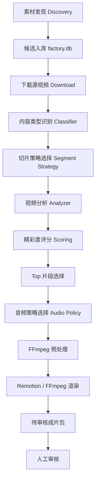

# JaguarTV 内容工厂：智能切片与内容类型策略架构需求说明

版本：Phase 1.1  
日期：2026-07-23  
适用项目：JaguarTV 多平台短视频内容工厂  
目标平台：YouTube Shorts、TikTok、Kwai、Facebook Reels  
当前阶段边界：只完成“爬取 / 下载 / 智能切片 / 二创剪辑 / 成片待审核”，不做自动发布、账号权限、复杂队列系统。

---

## 1. 项目目标

当前内容工厂的核心目标是批量生产适合巴西用户观看的短视频素材，通过多平台矩阵号为 JaguarTV 带来下载和注册转化。

本阶段要解决的问题不是单纯“把视频剪短”，而是让系统具备基本的内容判断能力：

1. 自动识别视频内容类型。
2. 根据内容类型选择合适的切片方式。
3. 根据内容类型选择音频策略。
4. 足球赛事类视频自动识别精彩片段。
5. 大部分无对白、音乐、体育、舞蹈类内容不强行生成葡语配音和字幕。
6. 动画少儿、肥皂剧等已有葡语原音的视频，优先保留原声，只叠加轻背景音乐。
7. 解说、教程、新闻、知识类内容才进入葡语本地化流程。
8. 所有成片统一增加 JaguarTV 品牌元素、角标、CTA 和尾图。

---

## 2. 当前系统能力

当前系统已经具备以下基础能力：

- 视频候选发现；
- 视频下载；
- 候选库存管理；
- 单条或批量制作；
- 30 秒以内 Shorts 切片；
- FFmpeg 快速渲染；
- Remotion 品牌化渲染；
- JaguarTV Logo、角标、尾图、CTA；
- `Jarg.top` 推广信息；
- 自动生成待审核包；
- 本地 UI 管理界面；
- Phase 1 登录态管理入口；
- 人工审核交付目录：`workspace/ready_for_review/`。

当前不足：

- 长视频主要按时间均匀切片，不知道哪个片段更精彩；
- 足球赛事没有进球、欢呼、冲刺、庆祝等识别逻辑；
- 不同内容类型没有独立音轨策略；
- UI 暂未完整暴露“内容类型 / 切片策略 / 音频策略”的人工覆盖入口；
- 成片元数据中缺少“为什么选这个片段”的可解释信息。

---

## 3. Phase 1.1 最小可用目标

本阶段新增一个“智能切片策略层”，让系统从“能剪”升级为“会挑”。

### 3.1 必须完成

1. 新增内容类型识别：
   - 足球赛事；
   - 体育集锦；
   - 舞蹈 / 音乐 / Funk；
   - 搞笑 / 生活 / 无对白；
   - 动画少儿；
   - 肥皂剧 / 短剧；
   - 解说 / 新闻 / 知识 / 教程；
   - 未知类型。

2. 新增切片策略：
   - 普通均匀切片；
   - 足球精彩切片；
   - 节奏切片；
   - 剧情安全切片；
   - 摘要式本地化切片。

3. 新增音频策略：
   - 只使用 Funk BGM；
   - 保留源音乐；
   - 保留原声 + 轻 Funk BGM；
   - 去除源音 + 葡语配音 + 葡语字幕 + Funk BGM；
   - 静音素材 + Funk BGM。

4. 足球赛事类视频自动寻找精彩片段：
   - 根据音量峰值、画面运动、镜头切换、关键词和回放信号评分；
   - 每个源视频输出最多 1-3 个 30 秒以内片段；
   - 每个片段给出开始时间、结束时间、精彩度分数和触发原因。

5. UI 中增加人工覆盖：
   - 内容类型；
   - 切片策略；
   - 音频策略；
   - 最大切片数量；
   - 单片最大时长；
   - 是否保留原声；
   - 是否添加 Funk BGM；
   - 是否生成葡语配音和字幕。

---

## 4. 总体架构



### 4.1 模块说明

| 模块 | 作用 |
|---|---|
| Discovery | 从 YouTube、B站、抖音、小红书等平台发现候选素材 |
| Download | 下载源视频、字幕、封面、元信息 |
| Content Classifier | 判断视频属于足球、舞蹈、动画、肥皂剧、解说等类型 |
| Segment Analyzer | 分析音频峰值、镜头变化、运动强度、OCR 文本 |
| Segment Scoring | 给每秒或每个窗口计算精彩度分数 |
| Segment Selector | 从评分中选出适合 Shorts 的片段 |
| Audio Policy Engine | 决定是否保留原声、是否加 Funk、是否生成葡语配音字幕 |
| Renderer | 使用 FFmpeg 或 Remotion 输出最终成片 |
| Review Package | 输出视频、封面、元数据、评分原因、平台文案 |

---

## 5. 内容类型规则

系统优先根据标题、描述、关键词、来源频道、标签、字幕语言进行判断。Phase 1.1 暂不依赖重型 AI 模型，先使用可解释规则。

```yaml
content_rules:
  football:
    keywords:
      - football
      - soccer
      - futebol
      - gol
      - goal
      - match
      - highlights
      - copa
      - penalty
      - messi
      - neymar
      - cristiano
    segment_strategy: sports_highlight
    audio_policy: source_plus_funk

  sports_highlight:
    keywords:
      - sports
      - nba
      - ufc
      - fight
      - knockout
      - race
      - volley
    segment_strategy: sports_highlight
    audio_policy: source_plus_funk

  dance_music:
    keywords:
      - funk
      - dance
      - baile
      - music
      - performance
      - dj
      - remix
    segment_strategy: rhythm_cut
    audio_policy: funk_or_source_music

  comedy_life:
    keywords:
      - funny
      - prank
      - fails
      - lifestyle
      - viral
      - meme
    segment_strategy: visual_peak
    audio_policy: funk_only

  cartoon_kids:
    keywords:
      - cartoon
      - kids
      - animation
      - desenho
      - infantil
      - criança
    segment_strategy: story_safe
    audio_policy: preserve_ptbr_voice_light_bgm

  soap_opera:
    keywords:
      - novela
      - drama
      - série
      - episode
      - romance
    segment_strategy: dialogue_scene
    audio_policy: preserve_ptbr_voice_light_bgm

  commentary:
    keywords:
      - explained
      - review
      - news
      - tutorial
      - story
      - documentary
    segment_strategy: summary_cut
    audio_policy: localize_ptbr
```

---

## 6. 音频策略

不是所有内容都需要配葡语和字幕。系统应按内容类型自动选择音频策略。

| 内容类型 | 默认音频策略 | 是否保留原声 | 是否加 Funk | 是否生成葡语配音 | 是否生成字幕 |
|---|---|---:|---:|---:|---:|
| 足球赛事 | `source_plus_funk` | 是 | 是 | 否 | 否 |
| 体育集锦 | `source_plus_funk` | 是 | 是 | 否 | 否 |
| 舞蹈 / 音乐 / Funk | `funk_or_source_music` | 可选 | 是 | 否 | 否 |
| 搞笑 / 生活 / 无对白 | `funk_only` | 否 | 是 | 否 | 否 |
| 动画少儿 | `preserve_ptbr_voice_light_bgm` | 是 | 轻量 | 否 | 否 |
| 肥皂剧 / 短剧 | `preserve_ptbr_voice_light_bgm` | 是 | 轻量 | 否 | 否 |
| 解说 / 新闻 / 教程 | `localize_ptbr` | 否 | 是 | 是 | 是 |
| 静音素材 | `bgm_only` | 否 | 是 | 否 | 否 |

### 6.1 推荐配置

```yaml
audio_policy:
  default: funk_only

  football:
    mode: source_plus_funk
    source_volume: 0.65
    bgm_volume: 0.35
    tts: false
    subtitles: false

  sports_highlight:
    mode: source_plus_funk
    source_volume: 0.55
    bgm_volume: 0.42
    tts: false
    subtitles: false

  dance_music:
    mode: funk_or_source_music
    source_volume: 0.35
    bgm_volume: 0.70
    tts: false
    subtitles: false

  comedy_life:
    mode: funk_only
    source_volume: 0.0
    bgm_volume: 0.75
    tts: false
    subtitles: false

  cartoon_kids:
    mode: preserve_ptbr_voice_light_bgm
    source_volume: 1.0
    bgm_volume: 0.12
    tts: false
    subtitles: false

  soap_opera:
    mode: preserve_ptbr_voice_light_bgm
    source_volume: 1.0
    bgm_volume: 0.10
    tts: false
    subtitles: false

  commentary:
    mode: localize_ptbr
    source_volume: 0.0
    voice_volume: 1.0
    bgm_volume: 0.28
    tts: true
    subtitles: true
```

---

## 7. 足球精彩切片算法

### 7.1 核心思路

足球精彩片段不是随机切出来的，而是从视频里找到“事件峰值”。

常见精彩信号：

- 观众欢呼；
- 解说音量突然升高；
- 镜头快速切换；
- 运动强度突然增强；
- 出现进球、射门、点球、庆祝、回放；
- 画面中出现 `GOAL`、`GOL`、`Replay`、比分变化等文字。

### 7.2 技术实现

| 信号 | 实现方式 | 工具 |
|---|---|---|
| 音量峰值 | 提取每秒 RMS / Peak 音量 | FFmpeg |
| 运动强度 | 抽帧后计算帧差 | OpenCV |
| 镜头切换 | scene detect / histogram diff | FFmpeg / OpenCV |
| 关键词 | OCR 画面文字或字幕文本 | OCR / 字幕解析 |
| 比分变化 | OCR 比分牌区域 | OCR |
| 回放信号 | OCR `Replay` / 镜头慢动作变化 | OCR / 运动分析 |

### 7.3 精彩度评分

```text
highlight_score =
  audio_peak_score      * 0.35 +
  motion_score          * 0.25 +
  scene_change_score    * 0.20 +
  keyword_score         * 0.15 +
  replay_score          * 0.05
```

### 7.4 切片窗口

当系统检测到一个精彩点，例如 `event_time = 83s`：

```text
start = event_time - 5s
end   = event_time + 25s
max_duration = 30s
min_duration = 12s
```

如果多个精彩点太接近，则合并窗口。  
如果一个源视频很长，则最多输出 Top 3 个 Shorts。

### 7.5 输出元数据

每个成片应记录：

```json
{
  "content_type": "football",
  "segment_strategy": "sports_highlight",
  "audio_policy": "source_plus_funk",
  "segment": {
    "start": 78.0,
    "duration": 30.0,
    "score": 86.4,
    "reasons": [
      "audio_peak",
      "high_motion",
      "scene_change",
      "goal_keyword"
    ]
  }
}
```

---

## 8. 切片策略定义

| 策略 | 适用内容 | 逻辑 |
|---|---|---|
| `uniform` | 默认兜底 | 按时间均匀切片 |
| `sports_highlight` | 足球、体育赛事 | 音频峰值 + 运动强度 + 镜头切换评分 |
| `rhythm_cut` | 舞蹈、音乐、Funk | 按节奏点、画面变化、高潮段落切片 |
| `visual_peak` | 搞笑、生活、无对白 | 按画面运动、镜头变化、表情动作峰值切片 |
| `story_safe` | 动画少儿 | 尽量保留完整小段剧情，不切断一句话 |
| `dialogue_scene` | 肥皂剧、短剧 | 根据对白停顿和场景切换切片 |
| `summary_cut` | 解说、教程、新闻 | 提取核心信息段，生成葡语摘要旁白 |

---

## 9. 推荐系统配置

建议在 `config/pipeline.yaml` 中新增：

```yaml
segment_intelligence:
  enabled: true
  default_strategy: auto
  max_segments_per_source: 3
  min_segment_sec: 12
  max_segment_sec: 30
  pre_event_sec: 5
  post_event_sec: 25
  min_highlight_score: 55

  analyzers:
    audio_peak: true
    motion: true
    scene_change: true
    subtitle_keywords: true
    ocr_keywords: false
    scoreboard_change: false

  sports:
    audio_peak_weight: 0.35
    motion_weight: 0.25
    scene_change_weight: 0.20
    keyword_weight: 0.15
    replay_weight: 0.05

  fallback:
    if_no_highlight_found: uniform
```

说明：

- `ocr_keywords` 和 `scoreboard_change` 可以先关闭，因为 OCR 会增加依赖和耗时；
- Phase 1.1 可以先实现音频峰值、运动强度、镜头切换；
- OCR 放到 Phase 1.2；
- 如果找不到精彩点，回退到当前已有的均匀切片逻辑。

---

## 10. UI 需求

### 10.1 内容库存页

每条候选素材增加：

- 内容类型；
- 切片策略；
- 音频策略；
- 预计可生成 Shorts 数；
- 精彩度最高分；
- 是否需要葡语本地化。

### 10.2 制作弹窗 / 按钮

制作前允许人工覆盖：

- 内容类型：自动 / 足球 / 舞蹈音乐 / 动画少儿 / 肥皂剧 / 解说知识；
- 切片策略：自动 / 均匀 / 体育精彩 / 节奏 / 剧情安全；
- 音频策略：自动 / Funk Only / 保留原声 / 原声 + Funk / 葡语配音字幕；
- 最大切片数：1 / 2 / 3；
- 单片最大时长：15 秒 / 20 秒 / 30 秒。

### 10.3 成片审核页

每个成片显示：

- 内容类型；
- 切片策略；
- 音频策略；
- 源视频时间段；
- 精彩度分数；
- 触发原因；
- 是否保留源音；
- 是否添加 Funk；
- 是否生成葡语配音；
- 是否生成葡语字幕。

---

## 11. 数据结构需求

建议在候选或制作元数据中增加以下字段。

### 11.1 Candidate 级别

```json
{
  "candidate_id": "84a09a44e065481a",
  "content_type": "football",
  "content_type_confidence": 0.82,
  "segment_strategy": "sports_highlight",
  "audio_policy": "source_plus_funk",
  "operator_override": false
}
```

### 11.2 Segment 级别

```json
{
  "package_id": "84a09a44e065481a_part01",
  "source_start": 78.0,
  "source_end": 108.0,
  "duration": 30.0,
  "highlight_score": 86.4,
  "highlight_reasons": [
    "audio_peak",
    "motion_peak",
    "scene_change"
  ]
}
```

### 11.3 Audio 级别

```json
{
  "audio_policy": "source_plus_funk",
  "source_audio_preserved": true,
  "source_volume": 0.65,
  "bgm_enabled": true,
  "bgm_volume": 0.35,
  "tts_enabled": false,
  "subtitles_enabled": false
}
```

---

## 12. 命令行需求

保留当前命令：

```bash
./.agents/skills/jaguartv-content-factory/scripts/factory.sh produce --candidate <id>
```

新增可选参数：

```bash
./.agents/skills/jaguartv-content-factory/scripts/factory.sh produce \
  --candidate <id> \
  --content-type football \
  --segment-strategy sports_highlight \
  --audio-policy source_plus_funk \
  --max-segments 3 \
  --max-duration 30
```

批量制作：

```bash
./.agents/skills/jaguartv-content-factory/scripts/factory.sh produce-batch \
  --status DOWNLOADED \
  --limit 10 \
  --strategy auto
```

---

## 13. 渲染策略

### 13.1 FFmpeg

适合：

- 快速切片；
- 批量产出；
- 基础 Logo / 尾图 / 音频混合；
- 服务器低成本生产。

### 13.2 Remotion

适合：

- 品牌感更强的视频；
- 动态角标；
- 更漂亮的尾图；
- CTA 动效；
- 更像“短视频模板”的成品。

建议：

- 默认批量跑 FFmpeg；
- 重点素材或审核通过率高的内容使用 Remotion；
- 后续可以把 Remotion 模板作为 JaguarTV 的品牌模板系统。

---

## 14. 验收标准

Phase 1.1 完成后，应满足以下验收标准：

1. 足球长视频可以自动输出 1-3 个 30 秒以内 Shorts；
2. 输出片段不是简单从开头切，而是靠音频/画面峰值选择；
3. 每个片段都有 `highlight_score` 和 `highlight_reasons`；
4. 足球视频默认保留现场声，并叠加 Funk BGM；
5. 舞蹈 / 音乐类不生成葡语配音字幕；
6. 动画少儿和肥皂剧默认保留葡语原音，只加轻背景音乐；
7. 解说类内容仍然可以进入葡语配音和字幕流程；
8. UI 可以人工覆盖内容类型、切片策略、音频策略；
9. 所有成片继续输出到 `workspace/ready_for_review/`；
10. 人工审核页面可以看到系统为什么选择这个片段。

---

## 15. 无法完成或暂不建议本阶段做的内容

本阶段不建议做：

- 完整 AI 训练闭环；
- 自动发布；
- 多账号权限管理；
- 多 Worker 队列调度；
- 大规模 OCR 比分牌识别；
- 自动判断版权风险；
- 自动判断平台封号风险；
- 自动跨平台热点追踪优化关键词。

这些内容可以放到 Phase 2 或 Phase 3。

---

## 16. 后续优化方向

### Phase 1.2

- OCR 识别 `GOAL`、`GOL`、`Replay`、比分变化；
- 足球比分牌变化检测；
- 自动生成更适合巴西用户的标题和发布文案；
- UI 增加精彩片段时间轴预览。

### Phase 2

- 自动发布队列；
- 多账号管理；
- 多平台发布状态监控；
- 内容表现数据回传；
- 关键词自动优化。

### Phase 3

- 根据播放量、完播率、点击率训练素材选择策略；
- 自动学习每个平台更适合的内容类型；
- 针对 JaguarTV 注册转化优化 CTA、尾图和视频结构。

---

## 17. 推荐优先级

当前最优先开发顺序：

1. 内容类型识别规则；
2. 音频策略引擎；
3. 足球精彩切片评分；
4. UI 人工覆盖入口；
5. 成片元数据展示；
6. OCR / 比分牌识别；
7. 自动发布与数据回传。

这条路线能最快把系统变成可生产工具，而不是停留在 demo。核心是先让它稳定地产出“能看、像样、适合平台、方便审核”的短视频。

