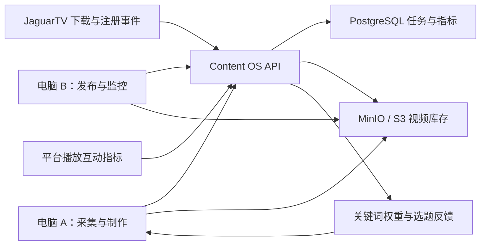

# JaguarTV Content OS：本地 UI 与双机部署方案

## 当前可运行版本

启动本地控制台：

```bash
cd "/Users/allen/Documents/视频二创"
.venv/bin/workbuddy ui --host 127.0.0.1 --port 8787
```

打开 `http://127.0.0.1:8787/`。如果只在可信局域网内共享，可改为 `--host 0.0.0.0`，其他电脑通过主机局域网 IP 访问。

当前 UI 已包含：

- 真实内容库存和任务状态。
- 发现、下载、制作任务入口。
- 成片预览和人工审核交接。
- YouTube、Facebook、TikTok、Kwai 发布队列。
- 播放、点击、安装、注册转化漏斗。
- 平台表现快照录入 API。
- 关键词表现和高表现内容反馈建议。
- Worker 节点与心跳数据模型。

真实平台自动发布和指标自动拉取尚未接入账号授权，因此发布队列目前是可执行任务合同，不会自行向外部账号发帖。

## 不依赖 WorkBuddy

`jaguartv_factory` Python 服务、FFmpeg、yt-dlp、SQLite/API 和浏览器 UI 都是独立运行的。WorkBuddy、CodyBuddy、Codex 只是可选的调用入口。即使 WorkBuddy 沙箱无法访问海外平台，Worker 仍可在合适网络位置直接运行 CLI 或 API。

## 目标拓扑



### 电脑 A：24 小时采集与制作

- 中国内容源 Worker：Bilibili、抖音、快手等，部署在中国网络环境。
- 海外内容源 Worker：YouTube、TikTok、Facebook、Kwai，部署在可稳定访问这些平台的网络环境。
- 按任务队列发现候选、去重、下载、转写、pt-BR 改写、剪辑、配音、BGM、字幕和 QA。
- 成片上传对象存储，状态改为 `READY_FOR_REVIEW`。

### 电脑 B：库存扫描、发布和监控

- 只领取人工审核通过的库存。
- 按平台、账号、时区和频率计划任务。
- 使用平台官方 API 或经过批准的发布连接器发送。
- 定期抓取播放、互动、链接点击和失败状态。
- 回传每个 candidate ID 对应的指标快照。

### 控制节点

- PostgreSQL 保存任务、账号引用、发布记录、平台指标和反馈建议。
- MinIO/S3 保存源视频、中间文件、成片、封面和字幕。
- API 负责领任务、租约、重试和节点心跳，避免两台机器重复处理同一 candidate ID。

## JaguarTV 转化归因

每条发布内容必须生成唯一追踪链接，例如：

```text
https://jaguartv.example/app?utm_source=tiktok&utm_campaign=content_factory&utm_content=<candidate-id>
```

JaguarTV 服务端或统计 SDK 需要回传：

- `landing_click`：进入落地页。
- `install`：完成 App 安装或首次打开。
- `registration`：完成注册。
- `activation`：完成关键激活行为，例如首次观看。

没有 candidate ID 或等价归因参数，系统只能看到平台播放量，无法判断哪些视频真正带来下载和注册。

## AI 反馈闭环

第一阶段不建议直接用高播放视频做模型微调。先把内容表现作为结构化标签：

1. 聚合题材、关键词、来源、时长、开头形式、字幕密度、BGM 和平台指标。
2. 计算播放完成率、分享率、点击率、安装率和注册率。
3. 形成 `BOOST_KEYWORD`、`REDUCE_KEYWORD`、`PREFER_SOURCE` 等待审核建议。
4. 审核通过后修改发现关键词权重和候选评分。
5. 累积足够的有标签样本后，再训练排序模型或做 LLM 微调。

这样反馈目标是 JaguarTV 注册和激活，而不是单纯追求播放量。

## 从本地 Demo 到正式双机

| 能力 | 当前版本 | 正式双机版本 |
|---|---|---|
| 控制台 | 本地浏览器 UI | 相同 UI，通过内网或 VPN 访问 |
| 数据库 | 单机 SQLite | PostgreSQL |
| 视频存储 | 本地 `workspace/` | MinIO/S3 |
| 任务执行 | 本机后台线程/CLI | Worker 领任务与租约 |
| 平台发布 | 队列模型 | 官方 API/批准的连接器 |
| 指标 | UI/API 快照录入 | 平台 API 与 JaguarTV 事件自动回传 |
| AI 反馈 | 规则生成建议 | 排序模型 + 审核后的关键词自动调整 |

正式部署前必须补充局域网鉴权、账号密钥加密、任务租约、重试上限、审计日志和数据库备份。
